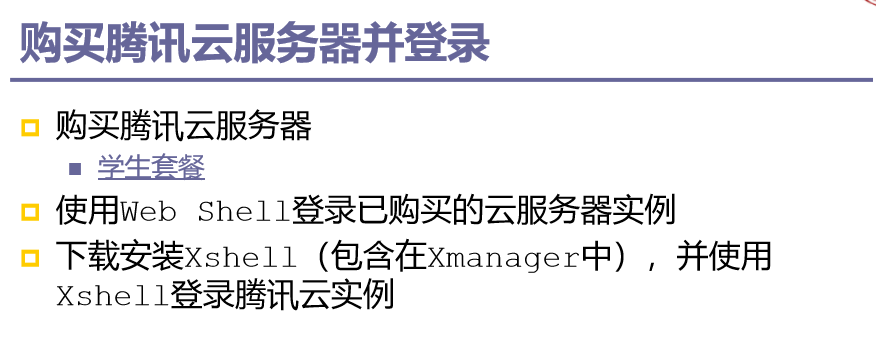
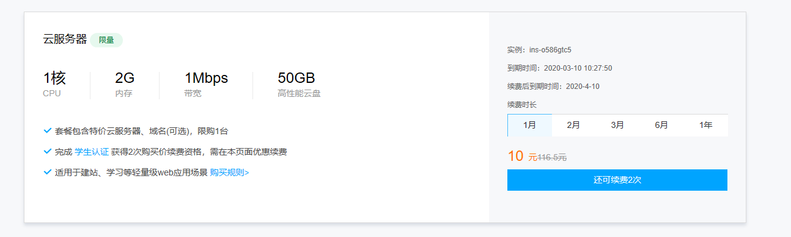

#                                  实验一

##                   李伟楠            软工闽台        116072017010

1.购买服务器

2使用web登入

3.使用xshell登入

1.创建账号

2.创建项目

同步到本地

 

同步成功

vmware在官网下载就可以了，我使用的的是vmware 12 pro

centos我是用的是阿里镜像

设置好配置等待安装

完成后登入

