查看操作系统内核信息

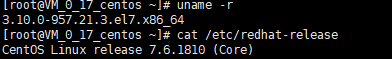

更新应用程序数据库

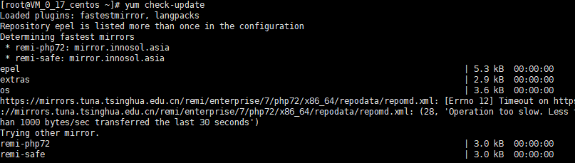

下载docker

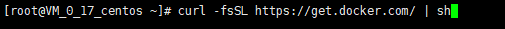

启动docker

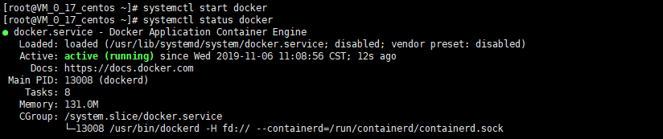

查看docker的版本

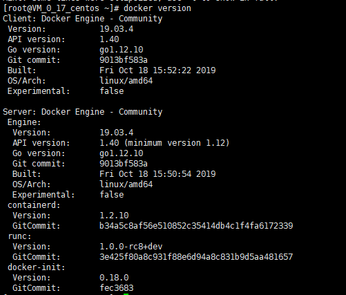

拉取centos 7

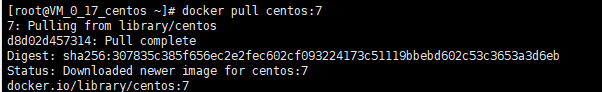

查看拉取之后的镜像

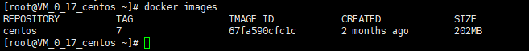

运行docker容器

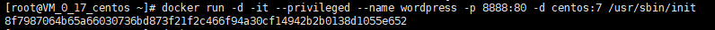

查看已经启动的容器

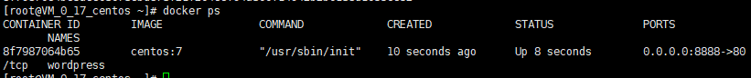

启动容器前台

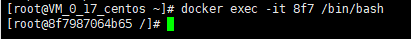

1.安装apache web服务器

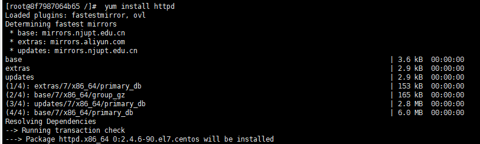

启动服务器

访问端口出现页面

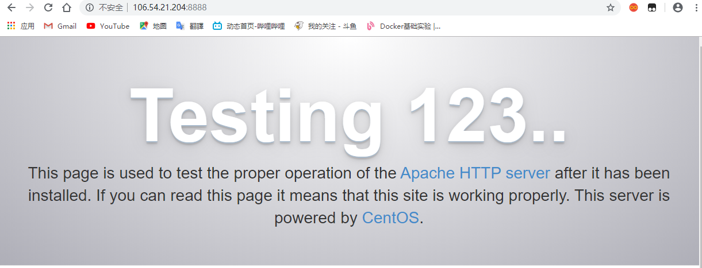

2.安装MySQL

安装mariaDB

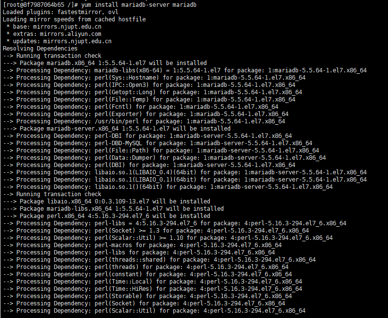

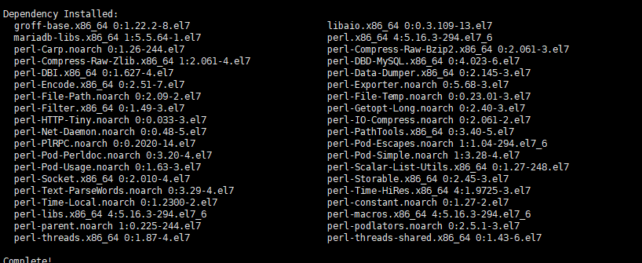

启动mariaDB

设置mysql密码

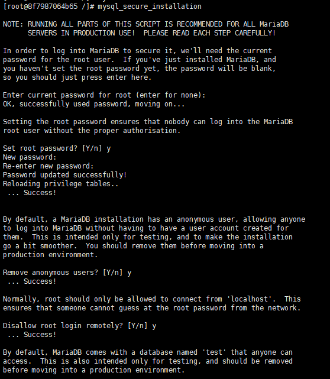

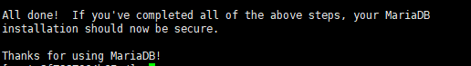

3.安装php

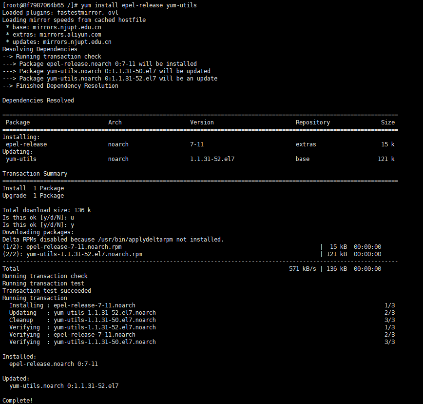

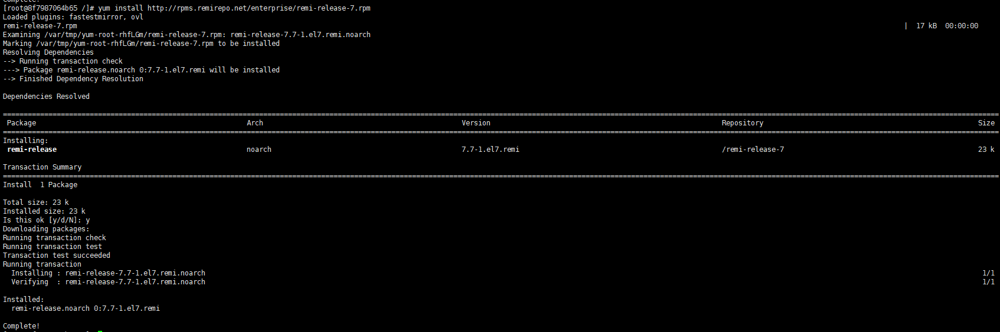

更新一下hph版本

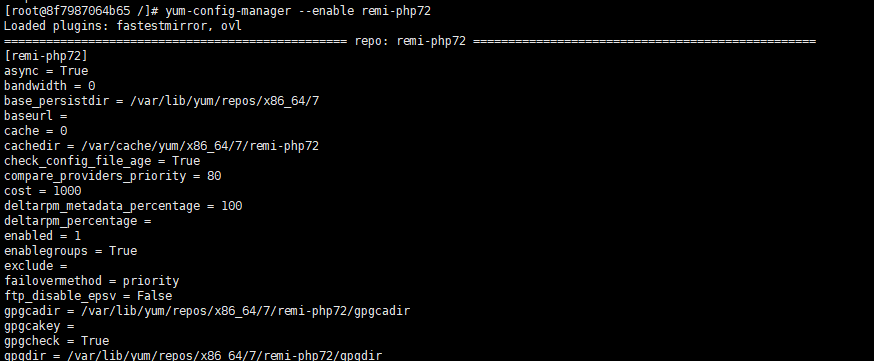

安装php以及php-mysql

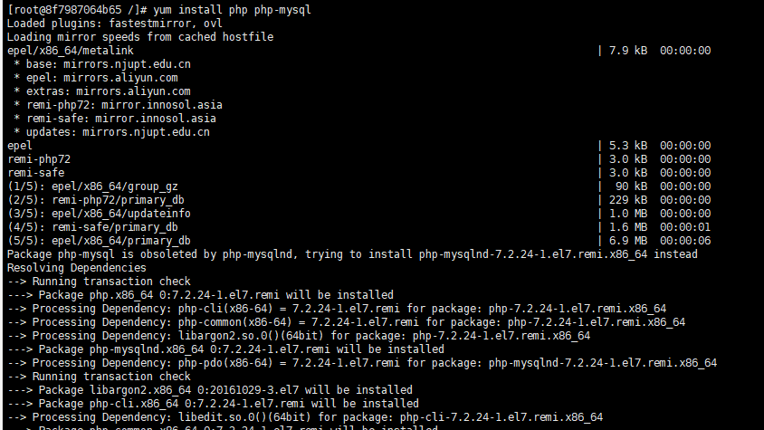

**重启Apache服务器以支持PHP**

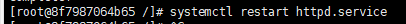

**重启Apache服务**

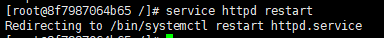

4.安装wordpress以及配置

登录数据库

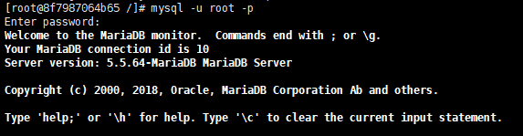

创建新的数据库并进入

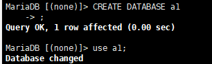

**为WordPress创建一个独立的MySQL用户并授权给数据库访问权限**

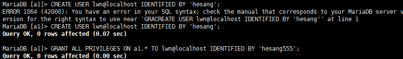

刷新MySQL的权限

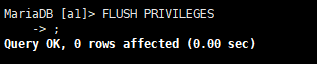

安装WordPress

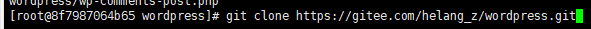

再解压安装

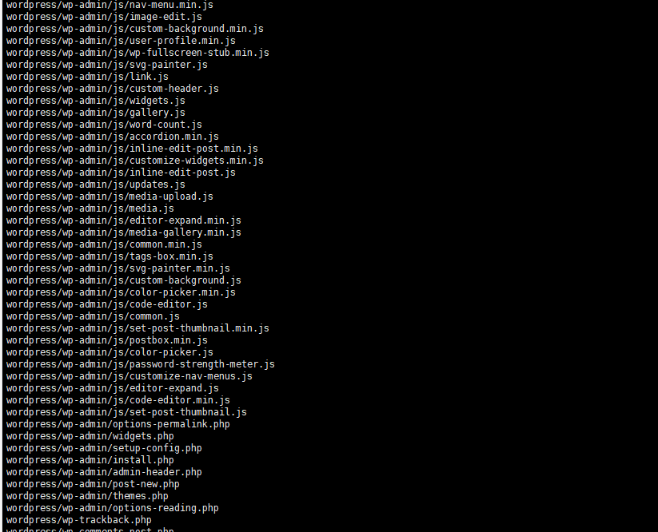

解压之后在目录下产生一个wordpress文件夹。我们将该文件夹下的内容同步到Apache服务器的根目录下，使得wordpress的内容能够被访问

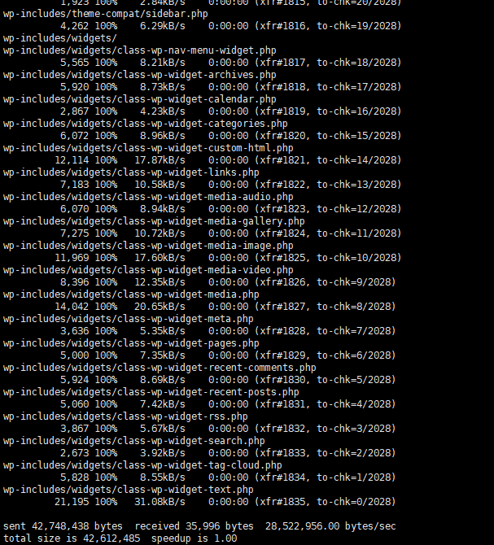

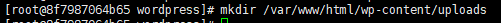

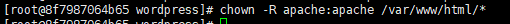

进入网页安装web网页

成功

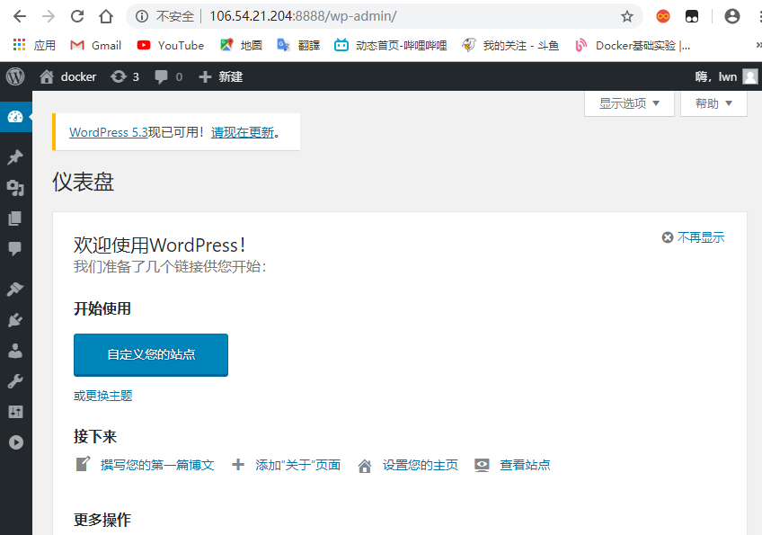1

将容器生成镜像

登入docker

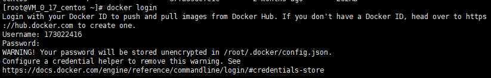

推送镜像

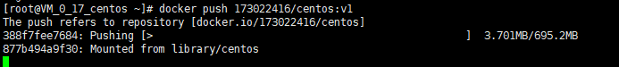

登入网站查看

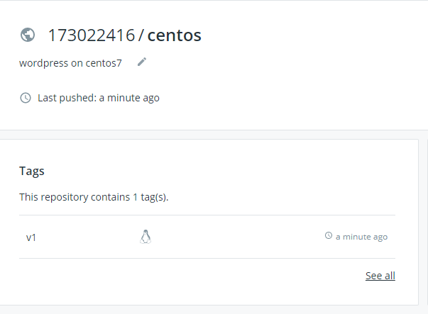

可以看到已经推送上去了

创建dockerfile文件

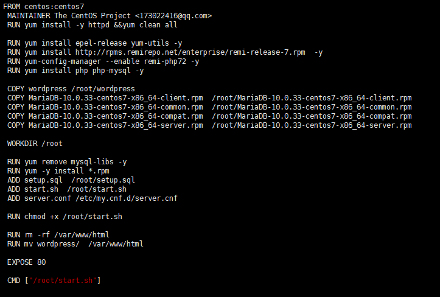

创建启动脚本start.sh

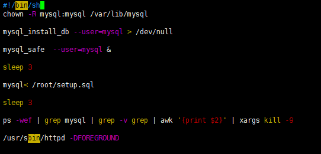

配置setup.sqlf文件

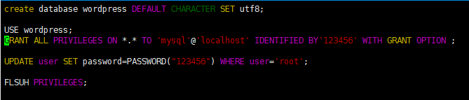

构建workpress容器

docker build --rm -t wordpress:centos7 .

（下载workpress中）

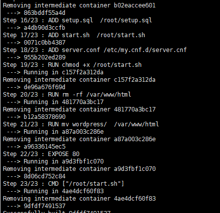

执行以下命令运行新构建的容器，并为 Nginx Web 服务器和 SSH 访问打开相应端口 。!

CID=$(docker run -d -p 1080:80 wordpress:centos7)

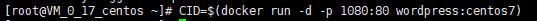

登入ip查看

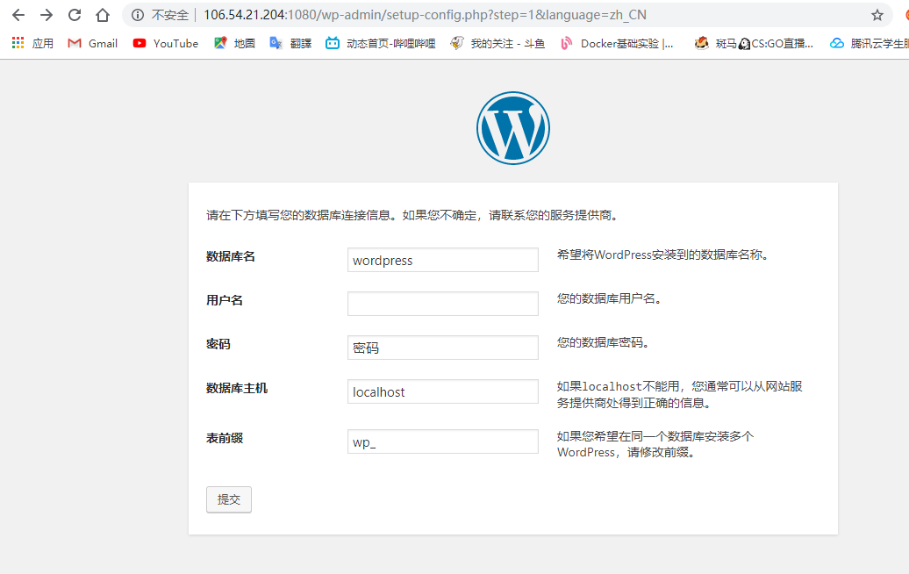

可是安装mysql配置文件老是有问题，没法一步到位完成注册