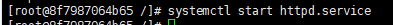
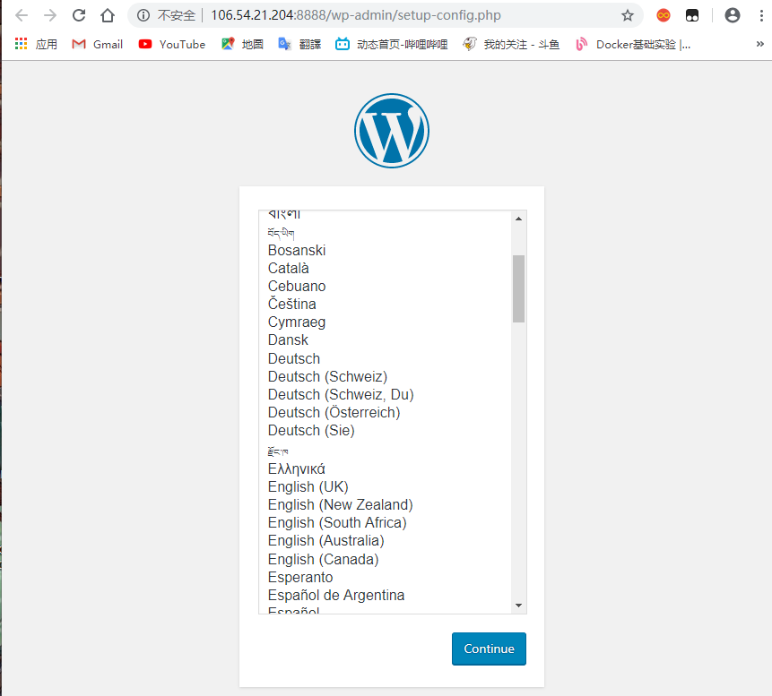
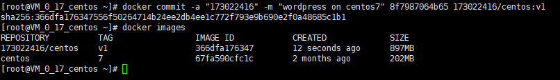

查看操作系统内核信息

更新应用程序数据库

下载docker

启动docker

查看docker的版本

拉取centos 7

查看拉取之后的镜像

运行docker容器

查看已经启动的容器

启动容器前台

1.安装apache web服务器

启动服务器

访问端口出现页面

2.安装MySQL

安装mariaDB

启动mariaDB

设置mysql密码

3.安装php

更新一下hph版本

安装php以及php-mysql

**重启Apache服务器以支持PHP**

**重启Apache服务**

4.安装wordpress以及配置

登录数据库

创建新的数据库并进入

**为WordPress创建一个独立的MySQL用户并授权给数据库访问权限**

刷新MySQL的权限

安装WordPress

再解压安装

解压之后在目录下产生一个wordpress文件夹。我们将该文件夹下的内容同步到Apache服务器的根目录下，使得wordpress的内容能够被访问

进入网页安装web网页

成功

1

将容器生成镜像

登入docker

推送镜像

登入网站查看

可以看到已经推送上去了

创建dockerfile文件

创建启动脚本start.sh

配置setup.sqlf文件

构建workpress容器

docker build --rm -t wordpress:centos7 .

（下载workpress中）

执行以下命令运行新构建的容器，并为 Nginx Web 服务器和 SSH 访问打开相应端口 。!

CID=$(docker run -d -p 1080:80 wordpress:centos7)

登入ip查看

可是安装mysql配置文件老是有问题，没法一步到位完成注册