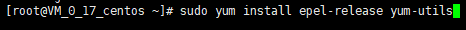

# 实验二

## 李伟楠                116072017010                软工（闽台）

1，安装Apache Web服务器

安装完成后启动

测试：在浏览器中输入ip地址106.54.21.204访问出现

2，安装MySQL

安装后启动mariadb

3，安装PHP

启动PHP 7.2 Remi仓库

安装PHP-mysql，并查看php版本

安装后重启服务器

安装php-fpm

测试PHP

在浏览器输入106.54.21.204/info.php

 

5，安装WordPress

以root用户登录MySQL数据库

创建一个独立的mysql用户

安装Wordpress，因为我下载的时候wordpress官网被墙了，所以我使用xftp上传到云服务器

可以看到我已经上传到~目录下了

解压

解压之后在主目录下产生一个wordpress文件夹。我们将该文件夹下的内容同步到Apache服务器的根目录下，使得wordpress的内容能够被访问

接着在Apache服务器目录下为wordpress创建一个文件夹来保存上传的文件

设置访问权限

配置WordPress

到 /var/www/html文件夹中拷贝wp-config-sample.php文件

通过nano超简单文本编辑器来修改配置

 

最后在浏览器中输入ip并注册

成功后就可以任意编辑了

