首先需要安装配置ntp服务

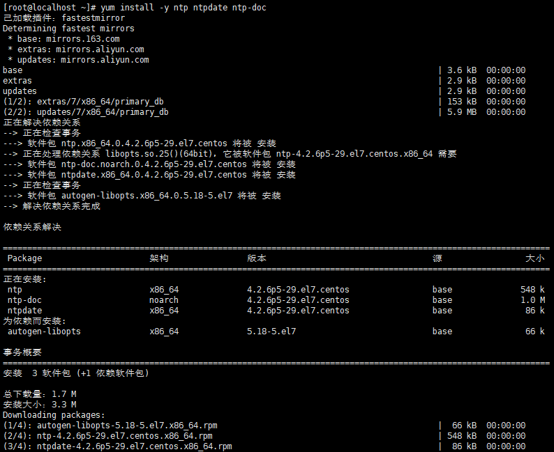

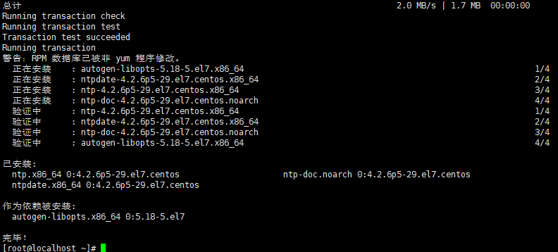

ntpdate 0.us.pool.ntp.org

hwclock --systohc

systemctl enable ntpd.service

systemctl start ntpd.service

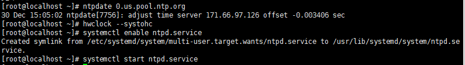

把SELINUX禁用掉

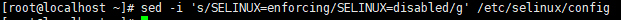

下载虚拟机运行需要的工具

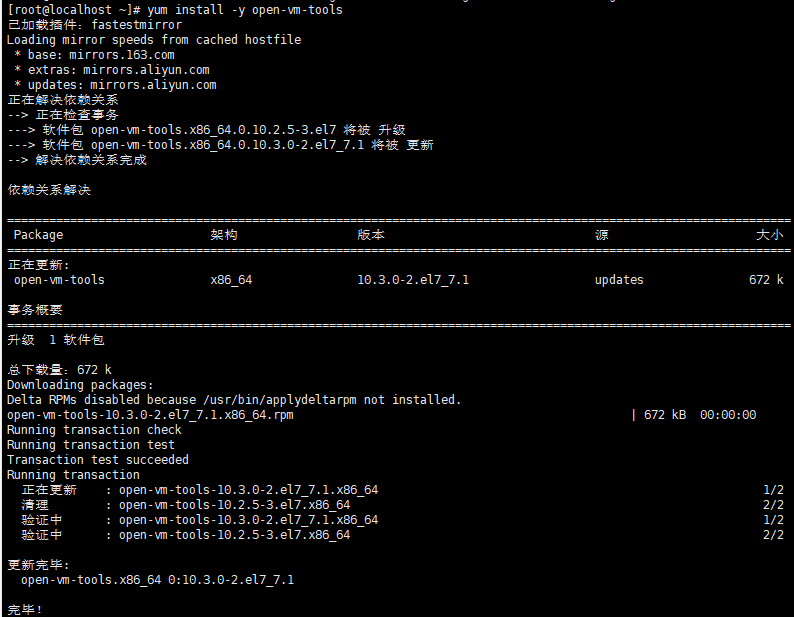

  复制虚拟机

<a>主控节点防火墙

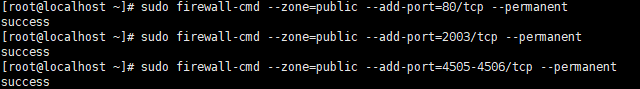

<b>monistor节点防火墙

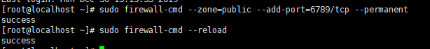

<c><d>普通节点防火墙

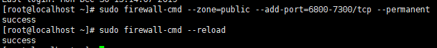

创建目录守护进程

<osd1>

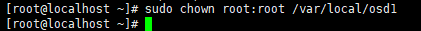

<osd2>

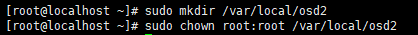

配置主控节点

vi /etc/hosts

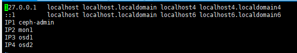

设置ssh

vi ~/.ssh/config

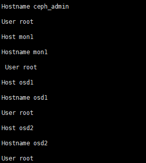

分发密钥

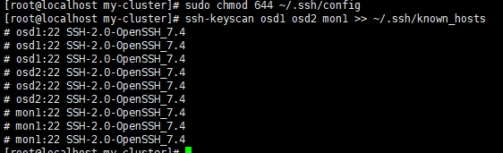

 ceph_admin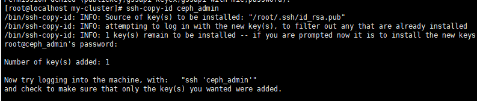

mon1

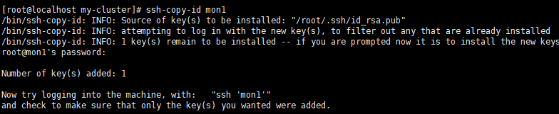

osd1

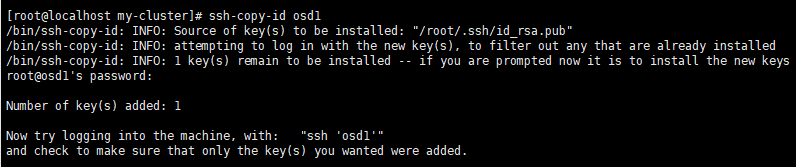

osd2

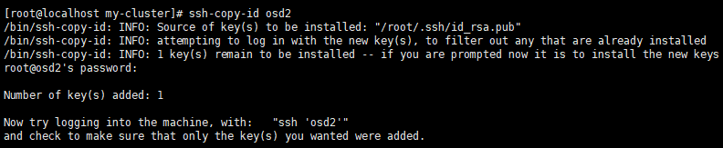

安装ceph-deploy

*sudo rpm -Uhv http://download.ceph.com/rpm-jewel/el7/noarch/ceph-release-1-1.el7.noarch.rpm*

*sudo yum update -y && sudo yum install ceph-deploy -y*

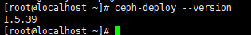

创建集群

mkdir my-cluster && cd my-cluster

ceph-deploy new mon1

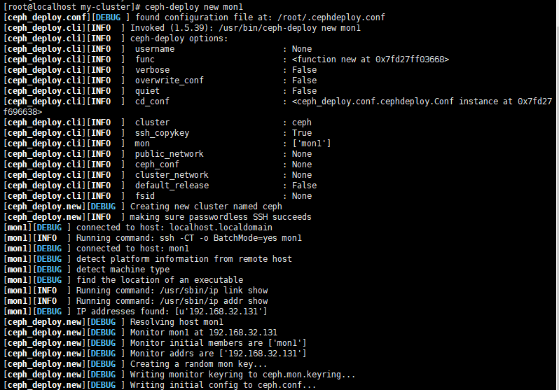

vi ceph.conf

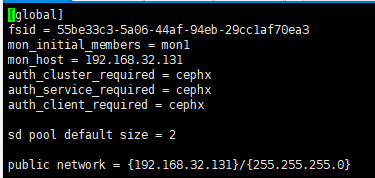

在各个节点安装ceph

ceph-deploy install ceph_admin mon1 osd1 osd2

然后就出问题了，

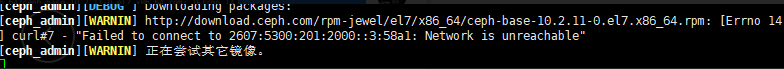

一直卡在这，然后我换了163网易的源还是不行

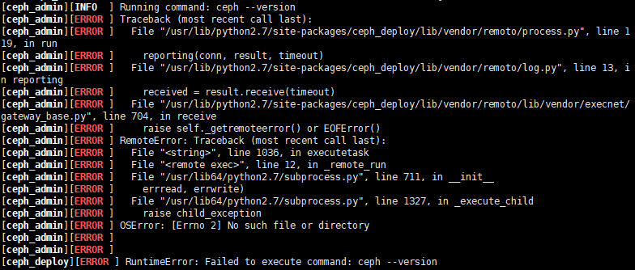

